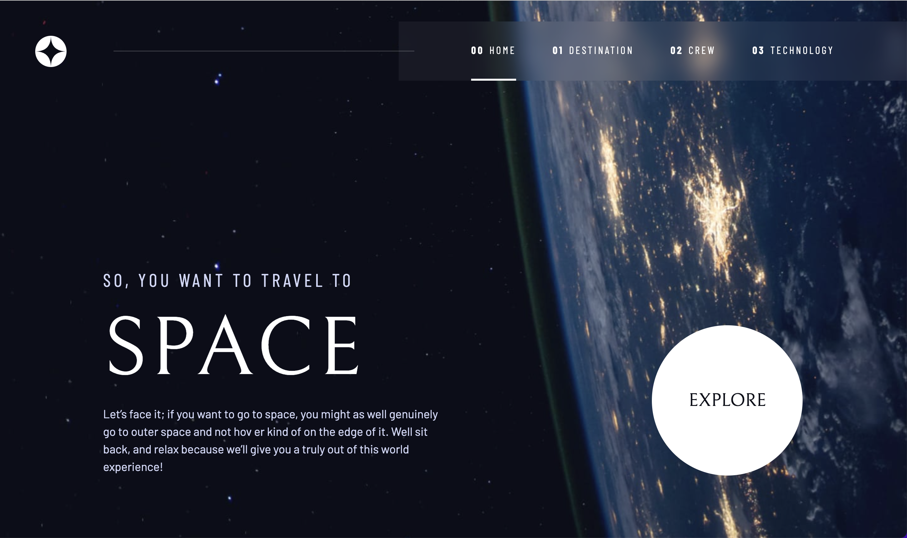

# Space tourism website - Frontend Mentor

This is a solution to the [Space tourism website challenge on Frontend Mentor](https://www.frontendmentor.io/challenges/space-tourism-multipage-website-gRWj1URZ3). Frontend Mentor challenges help you improve your coding skills by building realistic projects.

## Table of contents

- [Overview](about:blank#overview)
    - [The challenge](about:blank#the-challenge)
    - [Screenshot](about:blank#screenshot)
    - [Links](about:blank#links)
- [My process](about:blank#my-process)
    - [Built with](about:blank#built-with)
    - [What I learned](about:blank#what-i-learned)
    - [Continued development](about:blank#continued-development)
- [Author](about:blank#author)
- [Acknowledgments](about:blank#acknowledgments)

## Overview

### The challenge

Users should be able to:

- View the optimal layout for each of the website’s pages depending on their device’s screen size
- See hover states for all interactive elements on the page
- View each page and be able to toggle between the tabs to see new information

### Screenshot



### Links

- Solution URL: [Add solution URL here](https://your-solution-url.com/)

## My process

### Built with

- Semantic HTML5 markup
- CSS custom properties
- Flexbox
- CSS Grid
- JavaScript
- Mobile-first workflow

### What I learned

One new technique that I hadn't used in a personal project yet was that of utility classes. In this project I made extensive use of them and certainly found them really useful! Specially for simple things like changing font-sizes and colors. As well as adjusting the spacing of the document using custom variables.

For the layout of this project I was challenged to use mostly CSS Grid. This has helped me get more comfortable with it and now I truly appreciate how easy-to-use and effective it can be at creating complex layouts quickly.

See below an example for the layout of the technology page:

```
.grid-container--technology {
    grid-template-columns: minmax(1rem, 1fr) minmax(0, 10rem) minmax(0,40rem) minmax(0, 40rem) minmax(0rem, 1fr);
    grid-template-rows: minmax(1rem, maxcontent) minmax(0, maxcontent);
    grid-template-areas:
      '. title title title title'
      '. tabs content image image';
  }
```

### Continued development

I will certainly continue to work with CSS Grid now, especially since sub-grid is apparently getting support from more browsers soon. I am looking forward to keep working and implementing all the learnings from this challenge in future projects.

## Acknowledgments

I want to thank Kevin Powell once again, for being the best CSS Guru on the internet.